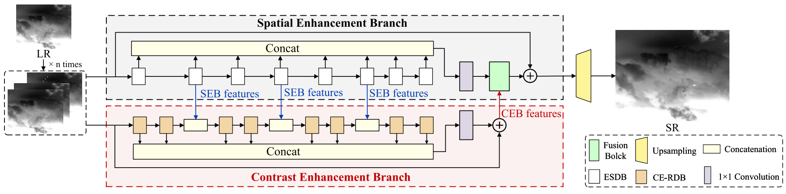
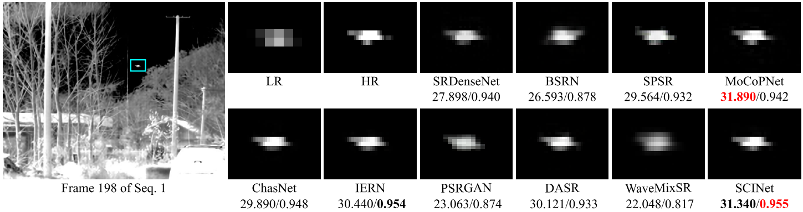

Official repositoryof our TGRS 2024 paper "SCINet: Spatial and Contrast Interactive Super-Resolution Assisted Infrared UAV Target Detection".

## Paper

[SCINet: Spatial and Contrast Interactive Super-Resolution Assisted Infrared UAV Target Detection](https://ieeexplore.ieee.org/document/10701558)   
Houzhang Fang; Lan Ding; Xiaolin Wang; Yi Chang; Luxin Yan; Li Liu; Jinrui Fang

## Citation
If you find our work useful in your research, please consider citing our paper using the following BibTeX entry:
```
@article{2024TGRS_SCINet,
    author    = {Houzhang Fang; Lan Ding; Xiaolin Wang; Yi Chang; Luxin Yan; Li Liu; Jinrui Fang},
    title     = {{SCINet}: Spatial and Contrast Interactive Super-Resolution Assisted Infrared {UAV} Target Detection},
    journal   = {IEEE Transactions on Geoscience and Remote Sensing},
    volume    = {62},
    year      = {2024},
    pages     = {1-22},
}
```

### Abstract

Unmanned aerial vehicle (UAV) detection based on thermal infrared imaging has been one of the most important sensing technologies in the anti-UAV system. However, the technical limitations and long-range detection of thermal sensors often lead to acquiring low-resolution (LR) infrared images, thereby bringing great challenges for the subsequent target detection task. In this article, we propose a novel spatial and contrast interactive super-resolution network (SCINet) for assisting infrared UAV target detection. The network consists of two main subnetworks: a spatial enhancement branch (SEB) and a contrast enhancement branch (CEB). The SEB embeds the lightweight convolution module and attention mechanism to highlight the spatial structure detail features of infrared UAV targets. The proposed CEB incorporates the center-oriented contrast-aware module and multibranch collapsible module, which can provide local contrast priors to reconstruct the super-resolved UAV target image. The spatial features of the intermediate layers from the SEB are integrated into the CEB as a rich gradient prior. Besides, the output features of the CEB are aggregated into those of the SEB for further supplementing the contrast of spatial features in return. Dual-branch feature interaction (DBFI) of the SEB and CEB can further enhance the spatial details and target saliency of the targets. In addition, we also introduce an infrared UAV detection network via a new dual-dimensional feature calibration module (DFCM) for boosting the detection performance. Extensive experiments demonstrate that the SCINet outperforms the state-of-the-art (SOTA) SR methods on real infrared UAV sequences and improves the detection performance of infrared small UAV targets. 

### SCINet Framework



### Visualization



## Environment

[PyTorch >= 1.7](https://pytorch.org/)  
[BasicSR >= 1.3.4.9](https://github.com/XPixelGroup/BasicSR)

### Installation

```
pip install -r requirements.txt
python setup.py develop
```

## How To Test

· Refer to ./options/test for the configuration file of the model to be tested, and prepare the testing data and pretrained model.  
· The pretrained models are available in ./experiments/pretrained_models/  
· Then run the follwing codes (taking net_g_SCINet_x4.pth as an example):  

```shell
python basicsr/test.py -opt options/test/benchmark_SCINet_x4.yml
```

The testing results will be saved in the ./results folder.

## How To Train

· Refer to ./options/train for the configuration file of the model to train.  
· Preparation of training data can refer to this page. All datasets can be downloaded at the official website.  
· Note that the default training dataset is based on lmdb, refer to [docs in BasicSR](https://github.com/XPixelGroup/BasicSR/blob/master/docs/DatasetPreparation.md) to learn how to generate the training datasets.  
· The training command is like  

```shell
CUDA_VISIBLE_DEVICES=0 python basicsr/train.py -opt options/train/train_SCINet_x4.yml
CUDA_VISIBLE_DEVICES=0,1,2,3 python -m torch.distributed.launch --nproc_per_node=4 --master_port=4321 basicsr/train.py -opt options/train/train_SCINet-S_x4.yml --launcher pytorch
```

For more training commands and details, please check the docs in [BasicSR](https://github.com/XPixelGroup/BasicSR)  

## Contact
If you have any question, please contact: houzhangfang@xidian.edu.cn,

Copyright: Xidian University.

## Acknowledgments
Some of the SR code is based on [BasicSR](https://github.com/XPixelGroup/BasicSR/). Thanks for their excellent work!

## License
MIT License. This code is only freely available for non-commercial research use.
